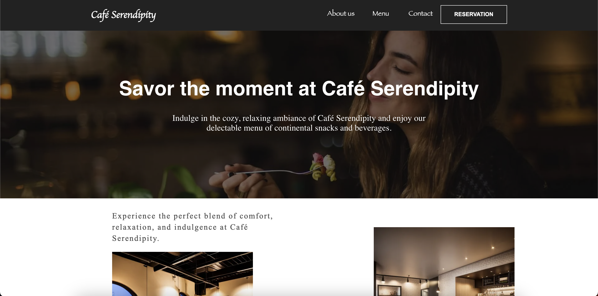
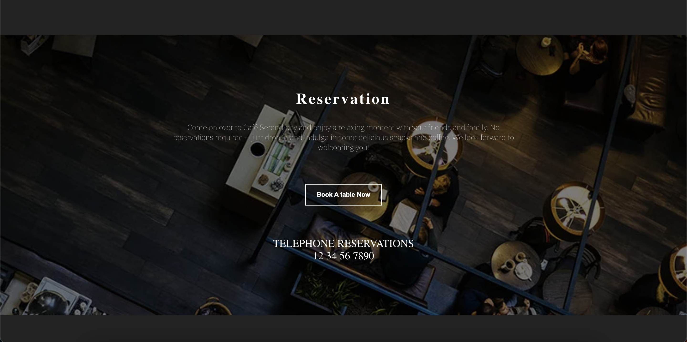
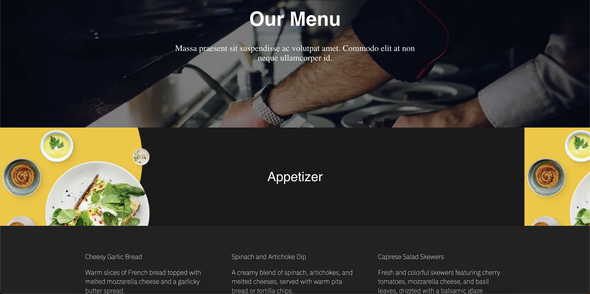
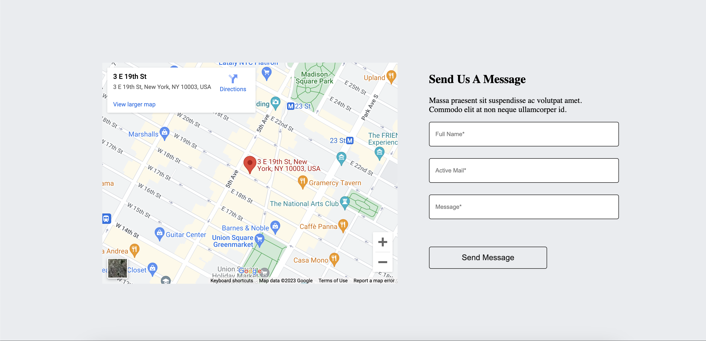
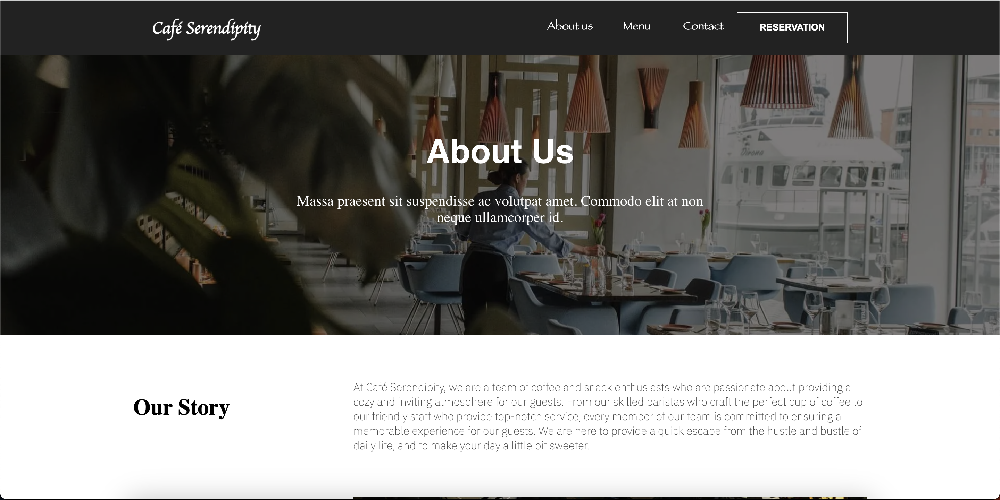
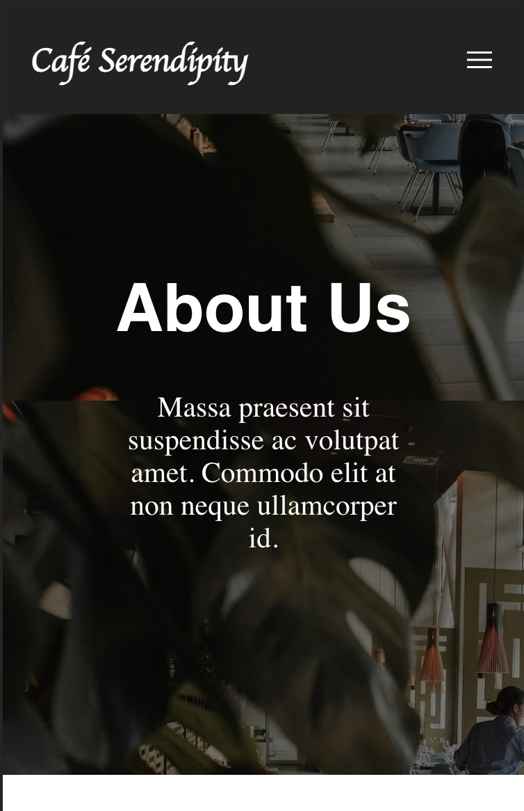

# *Café Serendipity*
This repository contains the codebase for the *Café Serendipity*, an Angular-based web application that showcases the cafe's offerings, menu, and provides a seamless online reservation experience.

## Features
- Interactive User Interface: The website provides an engaging and user-friendly interface for visitors to explore the cafe's services, ambiance, and menu.

- Online Reservations: Visitors can conveniently make table reservations online, selecting the desired date, time, and party size.

- Menu Display: The website showcases the cafe's menu with enticing visuals and detailed descriptions of various food and beverage options.

- Google Maps Integration: The website incorporates Google Maps API to display the cafe's location and help visitors easily find their way.

- Responsive Design: The website is fully responsive and optimized for various devices, ensuring a seamless experience across desktops, tablets, and mobile devices.

## Prerequisites
Before running the application, ensure that you have the following:
- Node.js: Make sure Node.js is installed on your machine. You can download it from https://nodejs.org.

- Angular CLI: Install the Angular CLI globally by running the following command: 
> npm install -g @angular/cli
### Getting Started
Follow these steps to set up and run the *Café Serendipity* website locally:
- Clone the repository:
> https://github.com/Priya31Gupta/cafe-serendipity.git
- Install dependencies:
> cd cafe-serendipity npm install
- Run the application:
> ng serve
- Open your browser and visit http://localhost:4200 to view the *Café Serendipity* website.

## Contributing
Contributions are welcome! If you'd like to contribute to the development of the *Café Serendipity* website, please follow these guidelines:

- Fork the repository and create a new branch.
- Make your changes and ensure they adhere to the coding style and best practices.
- Write tests for any new features or modifications.
- Submit a pull request, explaining the changes made and the rationale behind them.

### Contact
For any inquiries or feedback, please contact the project maintainers:
- Priya Kumari Gupta : [priyakumarigupta790@gmail.com](mailto:priyakumarigupta790@gmail.com)
- Priya Kumari Gupta : [Priya-kumari-gupta](https://www.linkedin.com/in/priya-kumari-gupta/)

Feel free to visit the live website at https://cafe-serendipity.vercel.app/

Enjoy exploring the *Café Serendipity* website!